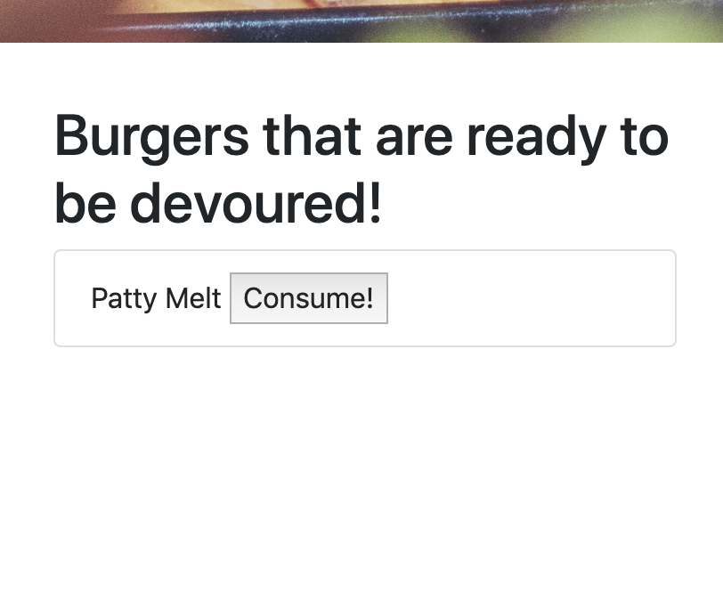
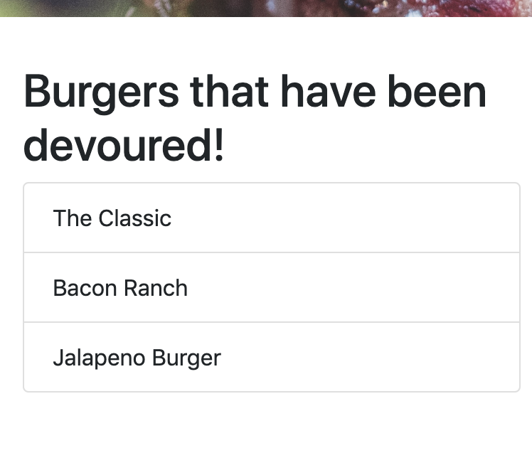

# Feast of Burgers

### What is Feast of Burgers?
Feast of Burgers is a full-stack application that lets the user enter the name of thier favorite burger that will store it and change the burger status from ready to be devoured to devoured. 

**_Example of Feast of Burgers_**

## API
Heroku is used to host the application.

### NPM who?
What does NPM stand for?

NPM is a comand line interface program to manage node.js Libraries (it stands for **node package manager**).

You will need to install the following NPM to run **Feast of Burgers**
* NPM Express
* NPM Express-handlebars
* NPM Mysql

## What is your favorite burger?!
There is a field where the user can enter thier favorite burger and click **Submit**.  The new burger entered will be stored into a database where the devoured state equals false.

**_Example of Burger to Submit_**

## The burger is ready to be Devoured!
After the user creates a burger it will be stored here with a **Devour** button that when clicked will change the devoured state to true.

**_Example of Ready to be Devoured_**

## Burgers you ate so far!
This section will show all the **Burgers** the user has _Consumed_.  

**_Example of burgers consumed_**

[Link to application](https://cryptic-brushlands-24761.herokuapp.com/)